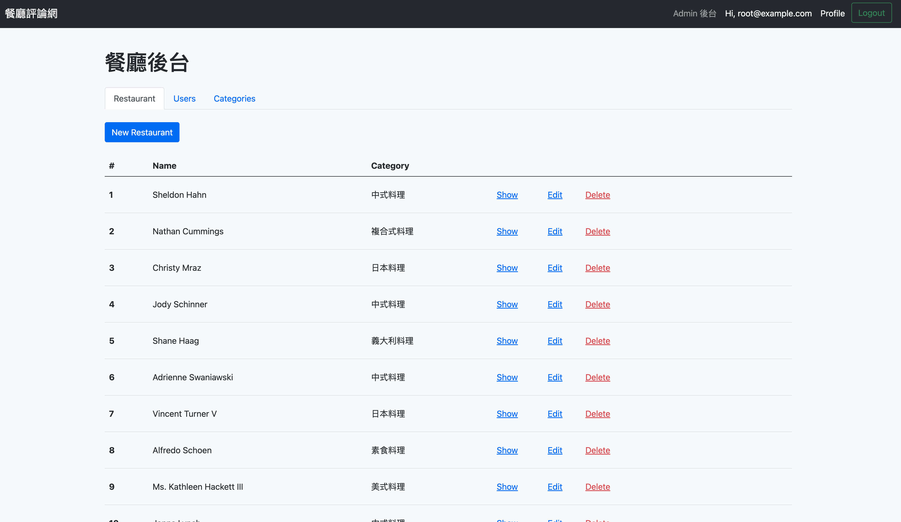
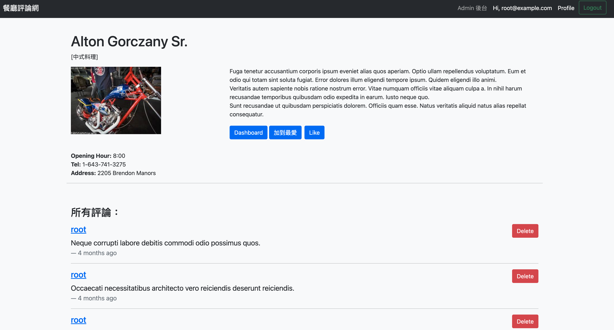

# The forum of restaurants






## Introduction

This application shows the list of restaurants and  reviews of each one. You can see the information and the food style of restaurant. And add it in your favorite list.

## Feature
#### *_Common users_*

- Read all restaurants about their category of food style, address, phone and reviews.
- Show the description of a restaurant.
- Can write review in the specific restaurant.
- Can add the specific restaurant in your favorite list or like it.
- The dashboard can see the counts of views, review and favorite list
- All review are sorted by the newest on the top.

 
#### *Root user*
- Root user can create the new restaurant
- Can add the new restaurant, edit or delete
- Can delete the specific review but can't edit it.
- Can set user to be admin.
- Can edit the information of specific restaurant, like opening hour, address, phone etc..
- Can create, edit or delete the category.

## Package environment

- Express ^4.18.2
- Express-handleBars ^6.0.6
- Node.js ^18.14.0 (or lower)
- MySQL ^8.0.31-arm64
- Sequelize ^6.6.5
- passport ^0.6.0
- jsonwebtoken ^9.0.0
- imgur ^1.0.2
- @facker-js/faker ^7.6.0
- method-override ^3.0.0
- multer ^1.4.5


## How to use

1. Confirm you have already install the npm and node.js
2. Clone this repository

   ```
   https://github.com/wenliangsu/forum-express-grading.git
   ```

3. Create the database "forum" in MySQL
4. Then type the command as following:
   ```
   sequelize db:migrate
   sequelize db:seed:all
   ```
5. You will see the message, and copy it into your browser.
   ```
   Express is listening on localhost:3000
   ```
6. Here are two accounts for testing:
   ```
   Account(1)
   email:root@example.com
   password: 12345678

   Account(2)
   email:user1@example.com
   password: 12345678
   ```
   
### Contributor

_Wen Su_
